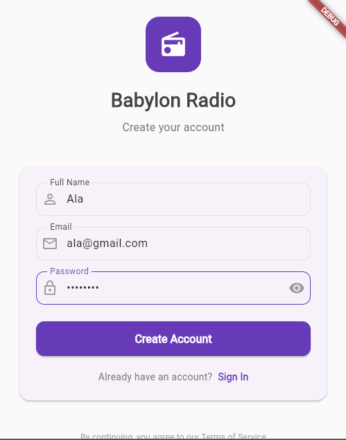
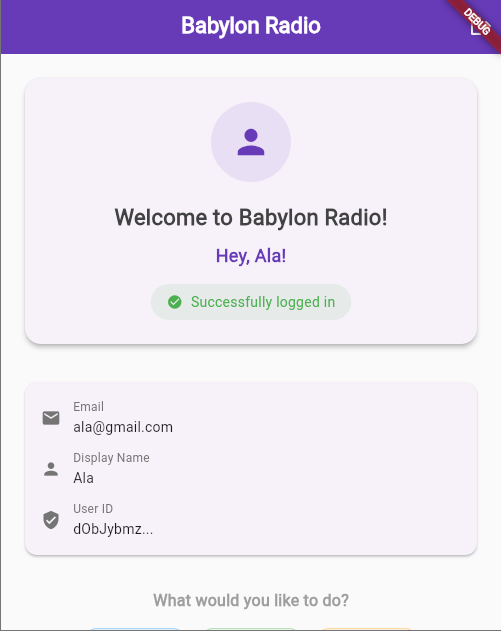
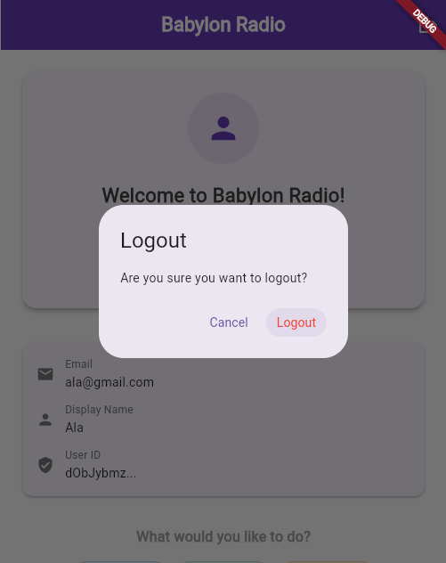

# Babylon Radio - Flutter Internship Assessment

A Flutter application with Firebase Authentication demonstrating user registration, login, and authentication flow for the Babylon Radio internship assessment.

## 🔒 Security First Approach

**All sensitive credentials and configuration files are securely managed and excluded from the repository** using environment variables and proper .gitignore configuration, ensuring no Firebase keys or authentication secrets are exposed.

## 📋 Project Overview

This application successfully implements all requirements specified in the Babylon Radio internship assessment task:

- ✅ **Firebase Authentication** setup and configuration
- ✅ **User Registration** with Full Name, Email, and Password
- ✅ **User Login** functionality for existing users
- ✅ **Home Page** with personalized greeting displaying user's name
- ✅ **Logout Functionality** with confirmation dialog
- ✅ **Input Validation** for all form fields
- ✅ **Error Handling** and user feedback

## 🚀 Features

### Authentication System
- **User Registration**: New users can create accounts with full name, email, and password
- **User Login**: Existing users can authenticate with email and password
- **Secure Logout**: Logout with confirmation dialog and session cleanup

### User Interface
- **Clean Design**: Professional and intuitive interface
- **Responsive Layout**: Works seamlessly on web and mobile platforms
- **Form Validation**: Real-time validation with helpful error messages
- **Loading States**: Visual feedback during authentication processes
- **Toast Notifications**: Success and error feedback for user actions

## 🏗️ Technical Architecture

### Project Structure
- lib/
- ├── main.dart # Application entry point & Firebase initialization
- ├── config/
-  │ └── firebase_config.dart # Environment-based configuration
- ├── screens/
-  │ ├── login_screen.dart # Combined login/registration interface
-  │ └── home_screen.dart # Post-authentication dashboard
- └── services/
- └── auth_service.dart # Firebase Auth business logic layer

### Dependencies
- `firebase_core: ^4.1.1` - Firebase core functionality
- `firebase_auth: ^6.1.0` - Authentication services
- `Flutter SDK` - Stable channel (^3.9.2)

### Firebase Configuration
- **Protected Configuration**: All Firebase keys managed via environment variables
- **Authentication Method**: Email/Password
- **Platform**: Web (Chrome/Edge compatible)

### Credential Protection
- ✅ **No hardcoded secrets** in the codebase
- ✅ **Environment variable** configuration
- ✅ **.gitignore** excludes all sensitive files
- ✅ **Secure initialization** without exposed keys

## 📸 Application Screens

### Registration Screen
Features the registration form with three input fields:
- Full Name (required)
- Email Address (with format validation)
- Password (minimum 6 characters validation)
- 

### Home Page
Post-authentication dashboard displaying:
- Personalized welcome message with user's name
- User information (email, display name, user ID)
- Feature buttons for radio functionality
- Logout button in app bar
- 

### Logout Confirmation
Security feature showing confirmation dialog when user attempts to logout, preventing accidental logouts.
- 
## 🔧 Installation & Setup

### Prerequisites
- Flutter SDK
- Firebase account with project setup
- Chrome browser for web testing

### Step-by-Step Setup

1. **Clone Repository**
   ```bash
   git clone https://github.com/AlaBhs/babylon-radio-app.git
   cd babylon-radio-app

2. **Install Dependencies**
   ```bash
   flutter pub get

3. **Firebase Configuration**
- Create Firebase project at console.firebase.google.com
- Enable Authentication → Email/Password provider
- Register web app and update configuration
- Use the provided .env.example template to set up your configuration

4. **Run Application**
   ```bash
   flutter run -d chrome

